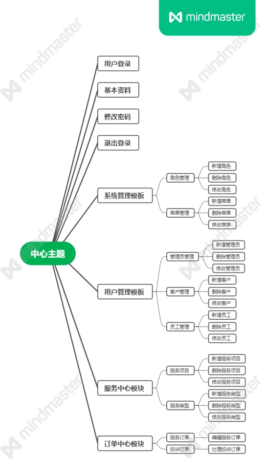
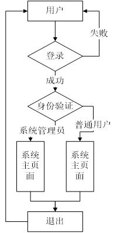
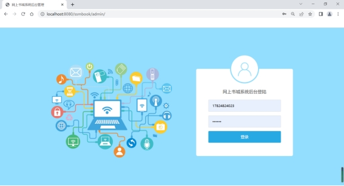
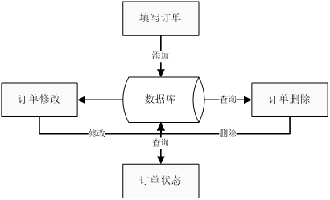
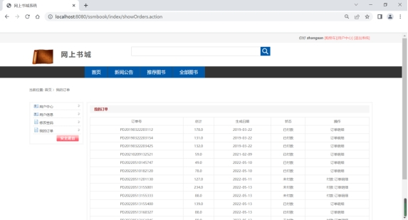

# 
SSM_BOOK
>

## 目录

#### 摘要

#### Abstract

#### 1引言

1.1 课题背景
1.2 国内外现状
1.3 课题内容
1.4论文的结构

#### 2关键技术

2.1  SSM框架
2.2  MySQL 数据库
2.3  IDEA

#### 3 开发环境与运行平台

3.1 开发环境
3.2 运行平台

#### 4 需求分析

4.1 系统的需求分析
4.1.1 系统需求
4.1.2 可行性分析
4.2 系统的功能简介

#### 5 系统的设计与实现

5.1 数据库设计
5.1.1 数据库设计概念
5.1.2 数据库分析
5.1.3  E-R图
5.2 数据表结构设计
5.3 软件模块结构设计
5.3.1 用户登录模块
5.3.2 订单管理模块

#### 6 系统的测试与维护

6.1 系统的测试
6.1.1 系统的测试原则
6.1.2 系统的测试方法
6.1.3 系统的测试用例及结果
6.2 系统维护说明

摘要

​	本文论述了基于SSM框架的图书系统进行商务活动的虚拟网络空间和保障商务顺利运营的管理环境，目的是可以让企业、商家可以充分利用此网上书城商城提供的网络基础设施、支付平台、安全平台、管理平台等共享资源有效的、低成本的开展自己的商业活动。
​	本系统分为前台销售系统和后台管理系统，前台用户系统，为用户提供：用户注册、购物车、商品浏览、订单管理等主要功能。后台管理系统，为管理员提供：管理员信息、网站用户信息 、图书信息、订单信息等功能。
​	[关键词] ssm；网上书城；网上商城；

 

Abstract

​	This article discusses the virtual network space for business activities based on the SSM framework of the comic system and the management environment to ensure the smooth operation of business, so that enterprises and merchants can make full use of the network infrastructure, payment platform, security platform, management platform and other shared resources provided by the comic purchase mall to effectively and low-cost carry out their own business activities.
​	The system is divided into front-end sales system and back-end management system, front-end user system, to provide users with: user registration, shopping cart, commodity browsing, order management and other major functions. The background management system provides administrators with functions such as administrator information, website user information, comic information, order information, etc.
​	Key words:  ssm； book purchase; online shop;

 

### 1引言

1.1 课题背景
	随着我国科技与计算机网络技术的快速发展，人们对生活的要求日益提高，生活节奏也不断加快。但由于各种原因，人们没有充足的时间去书店购买图书，于是，网上购买图书便成了人们生活中不可或缺的一部分。电子商务的发展和壮大可以说是互联网时代的必然产物，它对于人们生活的影响是非常大的，使人们可以足不出户就可以购买到心仪的书籍。
	网上购买图书的优势在于选择面大、价格便宜、交易方便、节省时间和精力等。整个图书市场一片繁荣，在这种情况下，网上书店的加入无疑将使得竞争更加激烈，但从另一个方面看，只有在这种激烈的竞争下，网上书店的优势才能得以体现。在中国，网上书店有发展的必要，也有发展的基础，发展网上书店的各方面条件也日趋成熟，但是还存在一些问题，只有把问题解决好了，才能保证网上书店的蓬勃发展。
	网上书城系统，是以当前商务的网络化、快速化实际需求为背景，实现网上书城的方便、快捷；实现通过Internet互联网对网上书城的相关信息进行发布及图书查询、图书介绍、图书内容浏览等功能。消费者通过网上书城系统进行图书的网上购物和网上支付等活动，这样即方便了消费者，又减少了企业成本。倡导“用户是伙伴，多为用户着想”的新型客户服务理念。因此，在网上书城系统实现显示其它用户购买情况和浏览产品情况。这些新型客户服务，具有与众不同的优势和特点，将成为和用户沟通、联系、发展的有效的方法。
	现在电子商务和实体经济融合发展，不仅为人们的生活带来了便利，而且降低了商家经营的成本。电子商务的发展还可以有效地提高企业的经济效益和国际竞争力。虽然目前网上购物很普遍，但在将来，也仍然有很大地发展潜力。

1.2 国内外现状
	随着科技的不断发展，人们生活水平的不断提高，网上购物已成为一种常见的购物方式。目前，大多数喜欢图书的年轻人处在繁忙的生活和工作中，没有足够的时间去线下店铺挑选自己喜欢的图书，于是他们选择网上购物，方便快捷。网上购物给人们的生活带来了便利，它不仅使人们随时随地可以浏览各种图书。另外，相比于线下书店的种类单一，网站上图书的种类更为繁多，节省了人们挑选的时间，也使顾客更方便地找到自己所喜欢的图书，不受时间和地点的限制。
	同时，由于网上销售的库存压力小，经营成本低，相比较于线下书店省下很多费用，越来越多的书店选择网上销售，而且网上销售使商家可以更快地调整经营战略，提高商家的竞争力和经济效益。
	但是，网上购物也有一定的缺点和不足，导致一些人仍对网上购买书图书抱有一种迟疑的态度。第一，网上购买图书的配送速度慢。第二，购买图书的质量。第三，自己适不适合这款图书，从而又导致了另一个问题——退换货不方便，网购的发货地在各个地方，只能通过快递来邮寄商品，如果需要退换货，就会比较麻烦。第四，现在网络诈骗现象随处可见，网上购物可能会泄露信息，成为诈骗分子的诈骗对象。还可能会有成为头盔对象、密码被盗的风险。第五，商家的信誉问题、售后服务问题和交易保障问题。
	正因为网上购物仍然存在着各种需要解决的问题，才使网上购物仍然具有巨大的发展潜力。纵观网上购物这几年的发展，这些问题都在不断地解决和完善中。因此可以预见，网上购物这种方式的发展，势必会随着人类的发展而越走越远。

1.3 课题内容
	本文研究的是网上购买图书系统的前台管理系统和后台管理系统。消费者使用前台管理系统，管理员使用后台管理系统。

1.4 论文的结构
	本论文逻辑结构分为五章，分别是绪论、软件需求分析、系统设计、系统实现、系统测试。
第1章，绪论。第2章，软件需求分析。第3章，系统设计。第4章，系统实现。第5章，系统测试。

### 2关键技术

2.1 SSM框架 
	SSM框架是Spring MVC ，Spring和Mybatis框架的整合，是标准的MVC模式，将整个系统划分为View层，Controller层，Service层，DAO层四层，使用Spring MVC负责请求的转发和视图管理，Spring实现业务对象管理，Mybatis作为数据对象的持久化引擎。
（1）Spring
	Spring它是为了解决企业应用开发的复杂性而创建的一个轻量级的Java 开发框架。Spring使用基本的JavaBean来完成以前只可能由EJB完成的事情。从简单性、可测试性和松耦合的角度而言，任何Java应用都可以从Spring中受益。 Spring有两大核心控制反转（IOC）和面向切面（AOP）。　　
（2）SpringMVC
	Spring MVC属于SpringFrameWork的后续产品，已经融合在Spring Web Flow里面。Spring MVC 分离了控制器、模型对象、分派器以及处理程序对象的角色，这种分离让它们更容易进行定制。
（3）MyBatis　
	MyBatis 本是apache的一个开源项目iBatis, 2010年这个项目迁移到了google code，并且改名为MyBatis 。MyBatis是一个基于Java的持久层框架。MyBatis 消除了几乎所有的JDBC代码和参数的手工设置以及结果集的检索。使用简单的 XML或注解用于配置和原始映射，将接口和 Java 的POJOs映射成数据库中的记录。
使用SSM框架具有以下几个优点：
	（1）成本低：Spring框架是企业型开发使用的成熟的开源框架，节省成本。
	（2）节省开发时间，典型的三层结构MVC（模型，视图模型，视图和控制），允许开发人员降低重新开发的复杂的问题，及时更改解决方案。对于敏捷开发的新需求，减少开发时间和成本。
	（3）良好的扩展性：SSM主流技术有强大的用户社区来支持它，所以这个框架是非常具有扩展性的，可根据特殊应用具有良好的可插入性，避免大多数因为技术问题无法实现的功能的困扰。
	（4）良好的可维护性：业务系统往往有新的需求，逻辑层和合理的分离表现层三层架构，降低风险可以进行修改，以最低的需求。对于流行的新技术或系统的老化，系统可能需要进行重构问题，SSM框架重构的成功率比其他框架要高得多。	总体来说SSM框架使用起来更加让人觉得轻快，更合理的分配资源，使得使用最小的资源完成当前的需求。

2.2 MySQL 数据库
	MySQL 是一款安全、跨平台、高效的，并与 PHP、Java 等主流编程语言紧密结合的数据库系统。该数据库系统是由瑞典的 MySQL AB 公司开发、发布并支持，由 MySQL 的初始开发人员 David Axmark 和 Michael Monty Widenius 于 1995 年建立的。
	MySQL  数据库管理系统的特点： 它是C和C++语言编写的、支持多个操作系统、支持多线程、为多种编程语言提供API、优化SQL算法提高了查询速度以及提供用于管理和检查数据库的管理工具 MySQL数据库 MySQL是一种关系型数据库管理系统，它将数据保存在不同的表中。 因此它的灵活性强，速度快强。 它具有两种模式：商业版跟社区版，一般新手都会选择社区版来创建自己的数据库系统。 由于它的体积小、速度快、成本低、最重要的是开放源码，所以中小型的公司都喜欢使用它作为网站数据库 上面提到关系型数据库，那么什么是关系型数据库： 关系型数据库是依据关系模型来创建的数据库。

2.3 IDEA
	2.3.1IDEA介绍
	IDEA全称IntelliJ IDEA，是java语言开发的集成环境。 idea提倡的是智能编码，目的是减少程序员的工作，其特色功能有智能的选取、丰富的导航模式、历史记录功能等，最突出的功能是调试（Debug），可以对Java代码、javascript、JQuery等技术进行调试。
	2.3.2 IDEA特点
	十分智能的协助开发；智能代码提示；参数提示；快速完成语句；Postfix Code 快速转换 [***\*if\****](https://haicoder.net/java/java-if.html)、[***\*for\****](https://haicoder.net/java/java-for.html) 等表达；Live Template 定义关键字，快速输出对应代码；强大的搜索功能；版本控制功能；重构代码功能；版本更新速度快

### 3 开发环境与运行平台

3.1 开发环境
	数据库使用的是MySql，该数据库是一个全面的数据库平台，能适应中小心企业的需求。MySql数据库引擎为关系型数据和结构化数据提供了更安全可靠的存储功能，使您可以构建和管理用于业务的高可用和高性能的数据应用程序。

3.2 运行平台
	为网络环境，对数据进行统一管理，并能与企业各部门实现数据共享。
	1）数据库服务器配置要求：处理器：Intel(R) Core(TM) i7-10510U CPU @ 1.80GHz  2.30 GHz，内存：16.0 GB，硬盘：512GB，操作系统：Windows 10，64 位操作系统, 基于 x64 的处理器
	2）软件开发工具：IDEA，数据库：MySQL Workbench 6.3 CE，JDK版本：jdk1.8.0_191，Tomcat版本：apache-tomcat-8.5.43
	3）客户端配置要求：硬件：Intel(R) Core(TM) i7-10510U CPU @ 1.80GHz  2.30 GHz ，内存：16.0G，硬盘：512GB，网络适配器：千兆以太网卡，网络：Internet连接畅通，软件：操作系统为Microsoft Windows 2010，Microsoft Windows XP和Microsoft Windows 7，浏览器为Microsoft Internet Explorer 6.0以上。
	备注：服务器的硬件配置会直接影响快递公司管理系统的性能发挥，所以建议在节约投资的情况下，尽量采用高性能的服务器系统。服务器的实际配置会随办公室自动化系统用户数的不同而有很大不同。

### 4 需求分析

4.1 系统的需求分析
	系统设计是在系统分析的基础上由抽象到具体的过程，同时，还应考虑到系统所实现的内外环境和主客观条件，本着实事求是的态度进行这一阶段的工作。
	系统设计阶段的主要目的是将系统分析阶段所提出的反映用户信息需求的系统逻辑方案转换成可以实施的基于计算机与通信系统的物理方案。
	这一阶段的主要任务就是从管理信息系统的总体目标出发，根据系统分析阶段对系统的逻辑功能的要求，并考虑到经济、技术和运行环境等方面的条件，确定系统的总体结构和系统各组成部分的技术方案，合理选择计算机和通信的软、硬件设备，提出系统的实施计划，确保系统总体目标的实现。
系统设计工作的特点：
	1）系统设计阶段，大量工作是技术性的。
	2）允许用户对已提出的信息需求做非原则性的修改或补充。
	3）用户在操作使用和运行环境等方面的具体要求也要在系统设计阶段加以明确并在系统的技术方案中得反映，因此系统设计人员还要同管理环境打交道。
	4）系统设计工作的环境是管理环境和技术环境的结合，是系统设计工作的重要特点。[7]
4.1.1 系统需求通过调查，要求系统需要有以下六种功能：
	1） 用户登录功能。2） 用户编辑功能。3） 系统管理功能。4） 图书管理功能。5） 图书信息功能。6） 订单中心功能。
4.1.2 可行性分析
	可行性分析的任务，并不是所有问题都有简单明显的解决办法，事实上，许多问题不可能在预定的系统 规模之内解决。如果问题没有可行的解，那么花费这项开发工程上的任何时间、资源、人力和经费都是无谓的浪费。 
	可行性研究的目的就是用最小的代价在尽可能短的时间内确定问题是否能够解决。必须记住，可行性研究的目的不是解决问题，而是确定问题是否值得去解。不能靠主观猜想，而只能靠客观分析。必须分析几种主要的可能解法的利弊，从而判断原定的系统目标和规模是否现实，系统完成后所能带来的效益是否大到值得投资开发这个系统的程度。 
	因此，可行性研究实质上是要进行一次大大压缩简化了的系统分析和设计的过程，也就是在较高层次上以较抽象的方式进行的系统分析和设计的过程。所以从以上的分析原则来看，我所设计的库存信息管理 系统是一个规模不太大的系统，但是目标明确，清晰的描述了对目标系统的一切限制和约束。本系统几乎在所有的快递公司使用，当然它需要进一步的完善和更新。在使用过程中，要看它能不能带来效益，毕竟在现今社会效率是第一位的。从现实看，这还是有一定的实用价值的，从另一个角度看，现实社会发展飞速，尊重科技势在必行，因此这也是开发本系统的一个非常重要的原因。21 世纪是计算机的时代，它必然取代一部分人的工作，高科技的监控系统进入社会生活的方方面面是发展的趋势。 [8]
	本设计从以下三个方面进行可行性研究： 
	1）技术可行性。本设计“网上书城系统”是为用户购买图书开发的。鉴于本人在数据库课程设计中且通过三个月毕业实习中的学习和实践，对开发管理信息系统又有了新的认识和提高，使自己在开发管理信息系统方面的技术更加成熟。由于本设计最重要体现的是实用性，所以，通过大量的社会调查和分析，结合自己现有的技术水平加上导师的指导，还是能按期完成本毕业设计。
	2）经济可行性。成本方面：由于本毕业设计属于计算机科学(本科)教学的最后一个环节，所以人力消 耗免费，资源学校提供，指导老师义务指导。所以成本计算只需计算开发期间开发者的生活消费，学校资源的消耗，所以开发本软件的成本是非常低的。效益方面：为企业开发一个完整、合理的快递管理系统， 可大大节余人力，以前需要多人干的工作，使用本系统只需一个人或几个人就能完成，且工作量和劳动强度大大降低。所以开发本软件可以为社会带来很好的经济效益。从以上分析看开发本软件在经济上是可行的。
	3）操作可行性。本软件的用户对象是该公司的的工作人员，由于本软件要设计成友好的界面，写出详细的使用说明，用户只需懂得简单的计算机操作知识，就能自由应用本软件。所以从以上几个方面的分析来看，开发本软件是完全可行的。 

 4.2 系统的功能简介
	本系统主要可以实现以下：用户登录，用户编辑，系统管理，图书分类，图书信息中心，订单中心模块功能。
	1） 用户登录。包括了用户输入登录主页功能。      
	2）   用户编辑。包括了用户编辑个人信息功能
	3）   系统管理功能。包括了管理员信息，用户信息管理等功能。
	4）   图书管理功能。包括了图书管理等功能。
	5）  图书信息功能。包括了图书名称，图书类型等信息。
	6）订单中心功能。含有订单信息。

### 5 系统的设计与实现

5.1 数据库设计
	5.1.1 数据库设计概念
	在办公室自动化系统中，需要处理的数据是现实办公中存在的事物及其联系的反应，该系统软件中与许多数据项，仅仅描述这些数据项是不够的，如何把它们以最优的方式组织起来，以满足系统对数据的要求是数据库设计的主要目的。因此对数据的设计是十分重要的，一旦设计的不妥当，对版本的更新、管理员的维护以及功能的改善以及在实际应用中都会有比较大的问题。
	5.1.2 数据库分析
	数据流是指处理功能的输入或输出。它用来表示一中间数据流值，但不能用来改变数据值。数据流是模拟系统数据在系统中传递过程的工具。
	数据流图是描述系统数据流程的工具，它将数据独立抽象出来，通过图形方式描述信息的来龙去脉和实际流程。
	5.1.3  E-R图
	E-R关系图是数据库逻辑设计的最常用方法，由实体、联系、属性三个基本部分组成。实体是现实世界中存在的客观事物，也就是要描述的对象；联系是实体之间的关系，在E-R图中，联系用菱形框表示，框内注明联系名；实体或联系的性质称为属性。
	1）对每个实体定义的属性如下：
	用户：{登录名，姓名，登录密码}
	图书：{订单号，名称，数量，备注}
	客户：{登录名，姓名，账号密码，联系方式，地址}
	订单信息：{订单号，订单类型，收件人电话，收件人地址，收件人姓名，发件人地址，发件人电话，发件人姓名}
	2）订单与客户E-R图 如图所示

​	3）系统总E-R图如图所示

5.3 软件模块结构设计
	5.3.1 用户登录模块
	1）功能描述：快递公司管理系统是提高企业内部之间交流和业务往来而研发的系统，只有企业员工通过Web界面提供的登录信息进入系统，系统会通过用户所填写的信息对用户进行审核，只有信息正确的用户，系统才将此用户导向主页。
	2）流程图如图5-8所示

​	3)实现的结果与截图

 

​	5.3.2 订单管理模块
​	1）功能描述
​		订单管理主要是对订单的填写、订单的修改和订单的删除以及打印等操作。
​	2）流程图如图5-10所示

​	3）实现的结果与截图

 

### 6 系统的测试与维护

6.1 系统的测试
	系统测试是管理信息系统开发周期中一个十分重要而漫长的阶段。其重要性体现在它是保证系统质量与可靠性的最后关口，是对整个系统开发过程包括系统分析、系统设计和系统实现的最终审查。
	系统测试的对象不仅仅是源程序，而是整个软件，即程序和文档。系统测试的目的是发现软件的错误，系统测试中可能发现的错误包括：功能错误、系统错误、过程错误、数据错误、编码错误。
	在本系统的测试过程中，我们运用了各种系统测试方法，对整个系统的主页、各功能模块及页面、数据库操作、程序代码和整体功能分别进行了详细的测试，保证了系统的质量、可靠性和可维护性。
	系统测试的目的是发现软件中的错误和缺陷，并加以纠正。应该排除对测试的错误观点，设计合适的测试用例，用尽可能少的测试用例，来发现尽可能多的软件错误。
	6.1.1 系统的测试原则
	1）所以得测试都应可追溯到客户需求。测试的目的是发现错误，而最严重的错误是那些导致程序无法满足需求的错误。
	2）应该在测试工作真正开始前的较长时间就进行测试计划。测试计划可以再需求模型完成时就开始，测试用例可以在设计模型确定后立即开始。
	3）Pareto原则可应用于系统测试。即测试中发现80%的错误可能来自于20%的程序代码。
	4)测试应从“小规模”开始，逐步转向“大规模”。先测试单个模块，再测试集成的模块簇，最后测试整个系统。
	5)穷举测试时不可能的。
	6）为了达到最有效的测试，应由独立的第三方来承担测试。“最有效”是指发现错误的可能性最高的测试。由于软件开发是一个创建软件的过程，而测试软件是一个发现错误的过程。
还有以下一些其他的测试原则：
	1）在设计测试用例时，应包括合理的输入条件和不合理的输入条件。大量的实践表明，用户在使用软件时，常常因为不熟练或不小心，而输入一些非法的或不合理的数据。因此应测试非法的或不合理的数据是否会导致软件的失效。
	2）严格执行测试计划，排除测试的随意性。不按测试计划进行的测试，常常不能保证测试的充分性。
	3）应当对每一个测试结果做全面检查。不严格检查测试结果，会遗漏经测试发现的错误，从而白白浪费测试所付出的代价。
	4）妥善保存测试计划、测试用例、出错统计和最终分析报告，为维护提供方便。因为在改正错误后或维护后要进行回归测试，即全部或部分地重复使用已做过的测试用例，以确保该修改未影响软件的其他功能。
	5）检查程序是否做了应做的事仅是成功的一半，另一半是检查程序是否做了不该做的事。
	6）在规划测试时不要设想程序中不会查出错误。如果在测试前就认为程序中没有错误，测试时就不会全力以赴地找错误，从而使测试部充分。
6.1.2 系统的测试方法 
	测试用例的设计方法大体可分为两类：白盒测试和黑盒测试，也称白箱测试和黑箱测试。
	1）白盒测试又称结构测试，这种方法把测试对象看做一个透明的盒子，测试人员根据程序内部的逻辑结构及有关信息设计测试用例，检查程序中所以逻辑路劲是否按预定的要求正确地工作。
白盒测试主要用于对程序模块的测试，包括：
	（1）程序模块中的所有独立路劲至少执行一次。
	（2）对所有逻辑判断的取值（“真”与“假”）都至少测试一次。
	（3）在上下边界及可操作范围内运行所有循环。
	（4）测试内部数据结构的有效性等。
常用的白盒测试方法主要有逻辑覆盖测试、基本路径测试、数据流测试和循环测试。
	2）黑盒测试又称行为测试，这种方法把测试对象看作一个黑盒子，测试人员完全不考虑程序内部的逻辑结构和内部特征，只依据程序的需求规格说明书，检查程序的功能是否符合它的功能需求。
	黑盒测试可用于各种测试，它试图发现以下类型的错误：
	（1）不正确或遗漏的功能。(2）接口错误，如输入输出参数的个数、类型等。(3）数据结构错误或外部信息（如外部数据库）访问错误。(4）性能错误。(5）初始话和终止错误。
	黑盒测试时依据软件的需求规约，检查程序的功能是否符合需求规约的要求。主要的黑盒测试方法有：等价类划分，边界值分析，比较值分析，比较测试，错误猜测和因果图方法。
6.1.3 系统的测试用例及结果
	1）界面检查
	打开系统页面，对照其中的界面名称及功能名称是否正确；对每个界面的各个下拉菜单、复选按钮进行检查，检查其是否有错误条目或缺少项目；并对链接按钮进行检查，检查其是否能够实现正常链接、安全返回的功能。
	2）功能测试
	检查每个模块下的显示、添加、修改、删除等功能是否可以正确实现，进而检查程序代码是否存在错误、数据库连接是否正常。
	3）综合测试
	在对各个模块分别调试之后，进行系统的综合测试，检测了几个模块共同调用一个数据库中的表对执行结果的影响。并检测了整体功能实现情况，最终实现了测试结果正确性。
4）测试用例
	(1)系统登录测试

表6-1等价类表

| 输入条件 | 有效等价类                      | 无效等价类 |
| -------- | ------------------------------- | ---------- |
| 登录身份 | 不为空（1）为无（3）为用户（4） | 为空（2）  |

表6-2测试用例

| 输入数据      | 预期结果         | 覆盖等价类                 |
| ------------- | ---------------- | -------------------------- |
| 登录身份=员工 | 输出管理界面     | （1），（3），（4），（5） |
| 登入级别=NULL | 无               | （2）                      |
| 登入级别=00   | 报错：用户不存在 | （6）                      |

(2)填写并检查注册信息的调试

表6-3 语句覆盖

| 测试数据                                                     | 预期结果 |
| ------------------------------------------------------------ | -------- |
| 客户姓名=王强登入密码=123456地址=福州市鼓楼区龙泉路28号客户登录名=wangqiang客户电话=13598623546QQ=123123 | 注册成功 |

表6-4 等价类表           

| 输入条件                                                     | 有效等价类                                                   | 无效等价类                                                   |
| ------------------------------------------------------------ | ------------------------------------------------------------ | ------------------------------------------------------------ |
| 客户姓名=王强 登入密码=123456 家庭地址=福州市鼓楼区龙泉路28号客户登录名=wangqiang 客户电话=13598623546 | 不为空（1） 2个字符以上（2）字母（3）数字（4）下划线（5）字母（9）数字（10） 字符（14）数字（15） 不为空（17）字母（18）数字（19）下划线（22）数值型（23） | 为空（6）＜2个字符（7）非字母数字（8）非字母数字（11）非字符数字（16） 为空（20）非字母数字（21） 非数值型（24）非数值型（26） |

表6-5 测试用例      

| 输入数据                                                     | 预期结果              | 覆盖等价类                                                   |
| ------------------------------------------------------------ | --------------------- | ------------------------------------------------------------ |
| 客户姓名=王强登入密码=123456[电子邮箱=123123@qq.com](mailto:电子邮箱=123123@qq.com)家庭地址=福州市鼓楼区龙泉路28号客户登录名=wangqiang客户电话=13598623546QQ=123123 | 信息合格，注册成功    | （1），（2），（3），（4），（5），（9），（10），（12），（14），（15），（17）,(18),（19），（22），（23），（25） |
| 用户名=NULL                                                  | 报错：用户不存在      | （6）                                                        |
| 用户名=王                                                    | 报错：用户名＜2个字符 | （7）                                                        |
| 用户名=…..                                                   | 报错：用户不存在      | （8）                                                        |
| 登入密码=￥                                                  | 报错：用户不存在      | （11）                                                       |
| 电子邮箱=123123qq.com                                        | 报错：数字后无@       | （13）                                                       |
| 客户登录名=NULL                                              | 报错：用户不存在      | （20）                                                       |
| 客户登录名=%                                                 | 报错：用户不存在      | （21）                                                       |
| 客户电话=我                                                  | 报错：电话非数值型    | （24）                                                       |
| QQ=yu                                                        | 报错：QQ非数值型      | （26）                                                       |

6.2 系统维护说明
	系统测试之后，我们进入了试运行及维护阶段，这一阶段的的目的是保证管理信息系统正常而可靠地运行，并能使系统不断得到改善和提高，以充分发挥系统本身的作用。在整个系统的运行过程中，系统的维护和管理是始终贯穿其中的，包括进行系统应用程序的维护、代码的维护、数据的备份与恢复、硬件设备维护。系统在运行时，也要随着环境的变化根据不同的需求及变化对系统进行必要的修改，使得系统功能更加完善。
	1）系统维护工作的内容
	系统维护工作贯穿于系统的整个运行过程中，包括：系统应用程序的维护、数据的维护、代码的维护、硬件设备维护，系统维护的重点是系统应用软件的维护工作。而系统维护工作不应总是被动的等待用户提出要求后才进行，应进行主动的预防性维护。
	2）系统维护的组织与管理
	系统维护性工作不仅是技术性工作，为了保证系统维护性工作的质量，需要付出大量的管理工作。系统投入运行后，设有系统管理员，专门负责整个系统维护的管理工作。系统维护要按照严格的步骤进行，防止未经允许擅自修改系统。因为无论是用户直接找程序人员还是程序人员自行修改程序，都将引起混乱，如不及时更新文档造成程序与文档不一致，多个人修改的不一致，以及缺乏全局考虑的局部修改。为了评价维护的有效性，确定系统的质量，记载系统所经历的维护内容，要将维护工作的全部内容以文档的规范化形式记录下来。维护就意味着修改，修改对子系统来讲是有副作用的。
	3）系统转换
	系统转换就是指新系统代替老系统的过程，即老系统停止使用，新系统开始运行。系统转换的目的是保证新老系统进行平稳而可靠的交接，最后使整个新系统正式交付使用。
	系统转换的内容主要包括数据文件转换、人员设备和组织机构的工作流程的改造和调整，有关资料的建档和移交等工作。系统转换方式可分为：直接转换、并行转换、分段转换。
	在比较了各种系统转换方式的特点和要求，并考虑到公司工作特点和要求，本系统的转换采用分段转换的方式，这样可以保证公司正常工作运转和新系统顺利投入使用。

### 7 总结与展望

​	本文是基于ssm的网上书城系统。本文的设计是出于对各种网上书城系统的理论和实践研究总结出来的一个较为优化的网上书城系统。通过软件工程的各种知识和概念，从系统的需求出发，进行系统的可行性分析，并作出系统的详细设计和数据库设计。从SSM框架出发阐述了系统的设计与实现。
​	1）本系统是根据为开发软件进行设计与实现的，通过改平台对系统进行了可行性的研究。
​	2）本文在开题前，对图书系统进行了大量的研究和分析，并根据自己所常用网上书城系统网站观察和记录，从自己所需功能和需求上对本网上书城系统进行了总体设计。
​	3）对mysql的数据功能和安全性进行了分析和研究，并对系统的模块进行了详细的设计。
由于时间紧迫，以及本人的能力有限，很多对网上书城系统的想法和特点的实现不够圆满，存在大量的漏洞，有待改善。
​	1）系统的安全性有待加强。系统采取的登录机制不够完善，存在大量安全隐患，对加密算法和加密密匙的技术不够全面，并没用在该系统中实现出来。
​	2）系统的数据稳定性有待加强。由于系统的测试只是在数据不完整的情况下进行的，对系统的存储和流转并没有经过测试。
​	3）对于一些系统中未发现的错误和不符合的地方，有待加强。